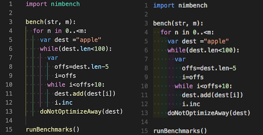

<h2> SAP CAP TypeScript extension pack </h2>

Welcome to the SAP CAP TypeScript VSCode Extensions Pack.

This curated collection of Visual Studio Code extensions is designed to enhance your development experience with SAP Cloud Application Programming (CAP) using TypeScript.

Whether you're managing CSV files, ensuring code quality, or streamlining your development workflow, these extensions will provide valuable tools and features to boost your productivity and code quality.

# Extensions

- [Extensions](#extensions)
  - [`Better-comments`](#better-comments)
  - [`Code Spell Checker`](#code-spell-checker)
  - [`Edit csv`](#edit-csv)
  - [`DotENV`](#dotenv)
  - [`Error Lens`](#error-lens)
  - [`npm Outdated`](#npm-outdated)
  - [`Pretty TypeScript Errors`](#pretty-typescript-errors)
  - [`Rainbow CSV`](#rainbow-csv)
  - [`Indent-Rainbow`](#indent-rainbow)
  - [`TODO HighlightTOD`](#todo-highlighttod)
  - [`Path Intellisense`](#path-intellisense)
  - [`and many more ...`](#and-many-more-)
- [Contributing](#contributing)
- [License](#license)
- [Authors](#authors)

## `Better-comments`

The Better Comments extension will help you create more human-friendly comments in your code.

## `Code Spell Checker`

A basic spell checker that works well with code and documents.

The goal of this spell checker is to help catch common spelling errors while keeping the number of false positives low.

## `Edit csv`

This extensions allows you to edit csv files with an excel like table ui

## `DotENV`

VSCode .env syntax highlighting

## `Error Lens`

ErrorLens turbo-charges language diagnostic features by making diagnostics stand out more prominently, highlighting the entire line wherever a diagnostic is generated by the language and also prints the message inline.

## `npm Outdated`

Displays a diagnostic message in package.json files for packages which have newer versions available as well as a code action to quickly update packages to their latest version.

## `Pretty TypeScript Errors`

Make TypeScript errors prettier and human-readable in VSCode.

## `Rainbow CSV`

Highlight columns in comma (.csv), tab (.tsv), semicolon and pipe - separated files in different colors.
Transform and filter tables using built-in SQL-like query language.
Optional sticky header line.
Provide info about column on hover.
Automatic consistency check for csv files (CSVLint).
Align columns with spaces and Shrink (trim spaces from fields).
Multi-cursor column edit.

## `Indent-Rainbow`

This extension colorizes the indentation in front of your text, alternating four different colors on each step. Some may find it helpful in writing code for Python, Nim, Yaml, and probably even filetypes that are not indentation dependent.

## `TODO HighlightTOD`

Highlight TODO, FIXME and other annotations within your code.

Sometimes you forget to review the TODOs you've added while coding before you publish the code to production. So I've been wanting an extension for a long time that highlights them and reminds me that there are notes or things not done yet.

Hope this extension helps you as well.

## `Path Intellisense`

Visual Studio Code plugin that autocompletes filenames.inte

## `and many more ...`

# Contributing

Pull requests are welcome. For major changes, please open an issue first
to discuss what you would like to change.

# License

Copyright (c) 2024 DXFrontier

Permission is hereby granted, free of charge, to any person obtaining a copy
of this software and associated documentation files (the "Software"), to deal
in the Software without restriction, including without limitation the rights
to use, copy, modify, merge, publish, distribute, sublicense, and/or sell
copies of the Software, and to permit persons to whom the Software is
furnished to do so, subject to the following conditions:

The above copyright notice and this permission notice shall be included in all
copies or substantial portions of the Software.

THE SOFTWARE IS PROVIDED "AS IS", WITHOUT WARRANTY OF ANY KIND, EXPRESS OR
IMPLIED, INCLUDING BUT NOT LIMITED TO THE WARRANTIES OF MERCHANTABILITY,
FITNESS FOR A PARTICULAR PURPOSE AND NONINFRINGEMENT. IN NO EVENT SHALL THE
AUTHORS OR COPYRIGHT HOLDERS BE LIABLE FOR ANY CLAIM, DAMAGES OR OTHER
LIABILITY, WHETHER IN AN ACTION OF CONTRACT, TORT OR OTHERWISE, ARISING FROM,
OUT OF OR IN CONNECTION WITH THE SOFTWARE OR THE USE OR OTHER DEALINGS IN THE
SOFTWARE.

# Authors

- [@dragolea](https://github.com/dragolea)
- [@sblessing](https://github.com/sblessing)
- [@ABS GmbH](https://www.abs-gmbh.de/) team
